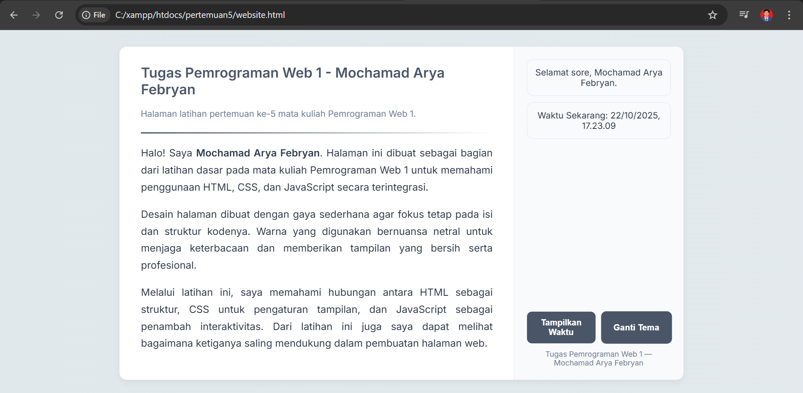
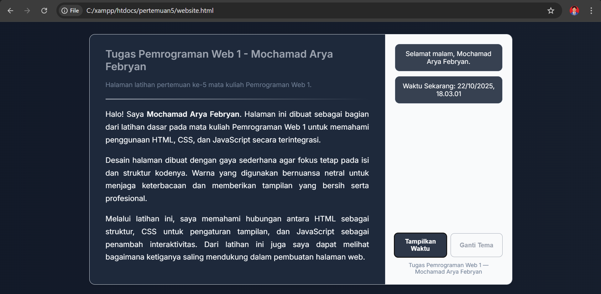

# Tugas Pemrograman Web 1 - Pertemuan 5  
**Nama:** Mochamad Arya Febryan  
**Mata Kuliah:** Pemrograman Web 1  
**Dosen Pengampu:** Nova Agustina, S.T., M.Kom.  
**Semester:** 5 (Lima)

---

## 📘 Deskripsi
Repository ini berisi hasil latihan dari **Pertemuan ke-5** mata kuliah *Pemrograman Web 1*.  
Latihan ini bertujuan untuk memahami dasar pembuatan halaman web menggunakan **HTML**, **CSS**, dan **JavaScript** dalam satu file terintegrasi.

File utama pada tugas ini adalah **website.html**, yang berisi:
- Struktur dasar HTML  
- Pengaturan tampilan dengan CSS  
- Interaksi sederhana menggunakan JavaScript  

---

## 🎨 Tampilan Halaman
Berikut hasil tampilan tugas:

Tampilan Dark Mode Otomatis aktif di malam hari  

Tampilan dirancang sederhana dengan kombinasi warna lembut agar mudah dibaca dan tidak membuat mata lelah.  
Bagian kanan berisi fitur penampil waktu dan tombol ganti tema yang dikendalikan dengan JavaScript.

---

## ⚙️ Fitur Utama
- ✅ **Sapaan Otomatis** berdasarkan waktu (pagi, siang, malam)  
- ✅ **Tombol Penampil Waktu** untuk menampilkan waktu lokal  
- ✅ **Tombol Ganti Tema** dengan animasi halus dan warna netral  
- ✅ **Dark Mode Otomatis** aktif di malam hari  
- ✅ Desain responsif dan minimalis  

---

## 🧠 Tujuan Pembelajaran
Melalui latihan ini, mahasiswa diharapkan dapat:
1. Mengenal struktur HTML untuk membangun halaman web.  
2. Menggunakan CSS untuk mengatur tata letak dan warna tampilan.  
3. Menambahkan fungsi interaktif dengan JavaScript.  
4. Memahami keterkaitan antara ketiga elemen tersebut dalam pengembangan web.

---

## 🚀 Cara Menjalankan
1. Pastikan file `website.html` berada dalam folder project.  
2. Buka file tersebut di browser (Chrome, Edge, atau Firefox).  
3. Klik tombol **"Tampilkan Waktu"** untuk menampilkan waktu lokal.  
4. Klik tombol **"Ganti Tema"** untuk mengganti warna tampilan.  

---

## 🧩 Teknologi yang Digunakan
- HTML5  
- CSS3  
- JavaScript (vanilla)  
- Visual Studio Code  
- XAMPP (untuk direktori lokal di `htdocs`)

---

## 📅 Informasi
Tugas ini disusun sebagai bagian dari latihan individu pada pertemuan ke-5 mata kuliah **Pemrograman Web 1**.    

---

© 2025 Mochamad Arya Febryan
